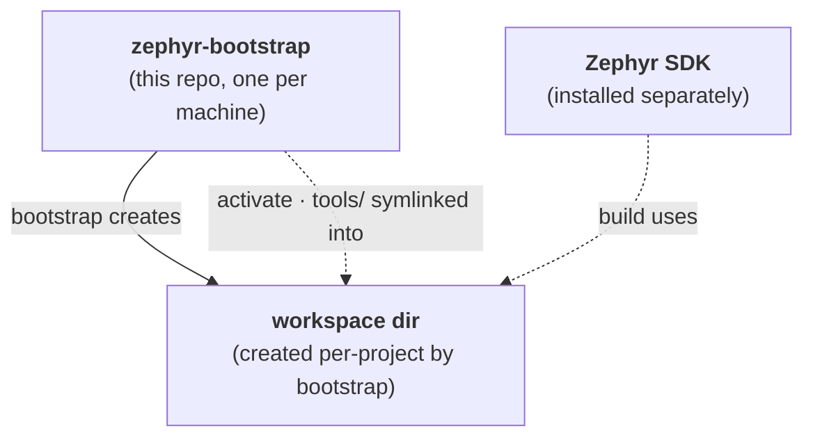

# zephyr-bootstrap

Reusable shell helpers for Zephyr T2 workspaces. Not specific to any single
application — drop into any workspace where you want a consistent
`source activate.sh` + `west flash` / `tools/serial-monitor.sh` workflow.

Licensed under [Apache-2.0](LICENSE), matching the Zephyr project itself.

## Workspace topology

What the bootstrap creates and how the three pieces — this tools repo,
the workspace it builds, and the host-installed Zephyr SDK — relate:



The **tools repo** holds `new-workspace.{sh,ps1}`, `seed-ide-templates.{sh,ps1}`, `activate.{sh,ps1}`, `tools/{flash,gdb-server,serial-monitor}.{sh,ps1}`, and `ide-defaults/`.

Each **workspace dir** the bootstrap creates contains:

```
<workspace>/
├── .venv/                 Python venv with west
├── .west/config           workspace-local west settings
├── activate.{sh,ps1}      ⇢ link or copy back to tools repo
├── tools/                 ⇢ link or copy back to tools repo
├── zephyr/                fetched by `west update`
├── modules/...            fetched by `west update`
└── <app>/                 cloned Zephyr application
    ├── west.yml · CMakeLists.txt · prj.conf · src/
    └── scripts/ide-setup/ (optional; overrides ide-defaults)
```

The **Zephyr SDK** is host-installed once (e.g. `~/zephyr-sdk-1.0.1/`) and shared across all workspaces — the bootstrap doesn't manage it.

The tools repo lives once per machine; each new project gets its own
workspace dir that links back to it. The Zephyr SDK is shared across
all workspaces.

## Prerequisites

The bootstrap is intentionally minimal in what it requires up front —
everything else (west, Python deps, optionally the Zephyr SDK) it
installs into the workspace itself.

### Linux / macOS

| Tool | Why | Install |
|------|-----|---------|
| `bash` | running `new-workspace.sh` | preinstalled |
| `git` | cloning the app repo | `apt install git` / `brew install git` |
| `python3` + `venv` | the workspace's Python venv (skip if you have `uv`) | `apt install python3-venv` / preinstalled on macOS |
| `uv` *(optional)* | ~10× faster venv + package installs | `curl -LsSf https://astral.sh/uv/install.sh \| sh` |
| `curl` + `tar` (xz support) | only with `--toolchain` — fetching/extracting SDK tarballs | preinstalled |

### Windows

| Tool | Why | Install |
|------|-----|---------|
| PowerShell 5.1+ or 7+ | running `new-workspace.ps1` | preinstalled / `winget install Microsoft.PowerShell` |
| `git` | cloning the app repo | `winget install Git.Git` |
| Python 3 (with venv) | workspace's Python venv (skip if you have `uv`) | `winget install Python.Python.3` |
| `uv` *(optional)* | faster venv + installs | `winget install --id=astral-sh.uv` |
| `7z.exe` | only with `-Toolchain` — extracting SDK `.7z` archives | `scoop install 7zip` |

The bootstrap does **not** install board-specific runners (openocd,
pyocd, J-Link, stm32cubeprogrammer) or serial terminals (picocom, tio).
Those depend on your target hardware and stay your responsibility — for
the Nucleo-H753ZI you'd want `openocd` from your distro / `scoop install
openocd`.

## What's here

Each helper has a bash and a PowerShell variant; pick whichever your shell
prefers. Both call into the same workspace state.

| File | Purpose |
|------|---------|
| `new-workspace.sh` / `new-workspace.ps1` | Bootstrap. Given a target directory and a Zephyr-app git URL, creates the workspace, clones the app, makes a venv, runs `west init -l` + `west update`, installs Zephyr's Python deps, and links `activate` + `tools/` from this repo. Bash version is `curl ... \| bash`-safe. |
| `update-workspace.sh` / `update-workspace.ps1` | Pull updates into an existing workspace: `git pull` the tools repo + the app repo, refresh activate/tools copies (Windows), `west update`, re-install requirements.txt, upgrade west + pre-commit, re-run `pre-commit install`. Idempotent; runs from inside the workspace by default. |
| `activate.sh` / `activate.ps1` | Activates the workspace's `.venv` and exports `ZEPHYR_BASE` / `ZEPHYR_SDK_INSTALL_DIR`. Source from the workspace root. |
| `tools/flash.sh` / `tools/flash.ps1` | `west flash` wrapper. Wired into CLion run configs and VSCode tasks. |
| `tools/gdb-server.sh` / `tools/gdb-server.ps1` | Starts openocd as a GDB server on `:3333`. Adjust the `-f board/...cfg` line for other boards. |
| `tools/serial-monitor.sh` / `tools/serial-monitor.ps1` | Opens the board's serial console. Bash: prefers `tio`/`picocom`, falls back to `stty + cat`. PS: uses `[System.IO.Ports.SerialPort]`; override port with `$env:PORT`. |
| `ide-defaults/{clion,vscode}-init.{sh,ps1}` | Fallback IDE setup used when the project doesn't ship its own. Generates `.idea/runConfigurations/` (CLion) or `.code-workspace` + `.vscode/tasks.json` (VSCode), skipping anything that already exists. |
| `seed-ide-templates.{sh,ps1}` | Copies the matching `ide-defaults/` files into a project's `scripts/ide-setup/` so you can fork them and customize. Once seeded, the bootstrap will run the project's copy instead of the in-repo defaults. |

## Bootstrap a new workspace

### Linux / macOS (bash)

```sh
# Local clone of this repo:
./new-workspace.sh ~/projects/foo-workspace https://github.com/me/foo.git

# With IDE setup hook + ARM toolchain install:
./new-workspace.sh --ide clion --toolchain arm \
    ~/projects/foo-workspace https://github.com/me/foo.git

# Or one-shot from the published repo:
curl -sL https://raw.githubusercontent.com/Assar63/zephyr-bootstrap/main/new-workspace.sh \
    | bash -s -- --ide vscode --toolchain arm \
        ~/projects/foo-workspace https://github.com/me/foo.git
```

### Windows (PowerShell)

```powershell
# Local clone of this repo:
.\new-workspace.ps1 C:\dev\foo-workspace https://github.com/me/foo.git

# With IDE setup hook + ARM toolchain install (needs 7-Zip on PATH):
.\new-workspace.ps1 C:\dev\foo-workspace https://github.com/me/foo.git -Ide vscode -Toolchain arm

# Or one-shot from the published repo:
iwr https://raw.githubusercontent.com/Assar63/zephyr-bootstrap/main/new-workspace.ps1 -OutFile new-workspace.ps1
.\new-workspace.ps1 C:\dev\foo-workspace https://github.com/me/foo.git -Ide vscode
```

The PowerShell port copies `activate.ps1` + `tools\` into the workspace
instead of symlinking, so it works on stock Windows without Developer
Mode. Re-run `new-workspace.ps1` to refresh after the tools repo is
updated.

`<app-repo-url>` must point at a Zephyr application that contains a
`west.yml` manifest at its root (T2 manifest-in-app topology).

The script uses [`uv`](https://docs.astral.sh/uv/) for the venv and
package installs if it's on `PATH` (Zephyr's `requirements.txt` pulls
~80 packages, ~10× faster), and silently falls back to
`python3 -m venv` + `pip` otherwise.

#### Heads-up: `pip` vs `uv pip` inside the workspace venv

When the bootstrap takes the **uv path**, `.venv/` is created with
`uv venv`, which by design **does not** pre-install `pip`. From an
activated workspace venv:

```sh
source activate.sh
pip install some-package          # ❌  command not found
uv pip install some-package       # ✓
```

Same flags, same effect — just route through `uv pip` instead. Nothing
in west or Zephyr's build system calls `pip` at runtime, so this only
matters if you're following a tutorial that invokes `pip install` from
inside the venv. On the pip fallback path (no uv on `PATH`), the venv
has pip as usual.

## Updating an existing workspace

```sh
# Linux / macOS, from inside the workspace:
~/projects/zephyr-bootstrap/update-workspace.sh

# Or with explicit workspace dir:
~/projects/zephyr-bootstrap/update-workspace.sh ~/projects/foo-workspace
```

```powershell
# Windows, from inside the workspace:
~\projects\zephyr-bootstrap\update-workspace.ps1
```

Pulls `git pull --ff-only` on both the tools repo and the cloned app
repo (`west config manifest.path` tells the script which subdir is the
app). Then `west update`, refresh of `zephyr/scripts/requirements.txt`,
upgrade of `west` + `pre-commit`, and re-run of `pre-commit install`.
Idempotent — safe to run any time.

On Windows the script additionally re-copies `activate.ps1` + `tools\`
from the tools repo into the workspace (Linux/macOS workspaces have
those as symlinks, so they update automatically).

**What it does not re-run:** the project's IDE init script
(`<app>/scripts/ide-setup/<ide>-init.{sh,ps1}`). That means changes
the project later makes to `west config` defaults, `.idea/runConfigurations/`
contents, or `.code-workspace` generation **won't propagate** through
`update-workspace`. If the project bumps its IDE setup, re-run
`new-workspace.{sh,ps1}` against the same workspace dir with
`--ide <name>` — every other step in the bootstrap is idempotent and
will skip; only the IDE init re-runs.

### Automatic pre-commit install

If the cloned app ships a `.pre-commit-config.yaml`, the bootstrap
installs the `pre-commit` package into the workspace venv and runs
`pre-commit install` inside the app's git checkout — so the hooks are
armed without a separate manual step. No-op when the project doesn't
ship a config.

### Optional Zephyr SDK install (`--toolchain` / `-Toolchain`)

Off by default. Comma-separated short names — `arm`, `arm64`, `riscv` — or
the literal `all` (full SDK, ~3 GB). After `west update` the bootstrap reads
the SDK version that the cloned `zephyr/SDK_VERSION` pins, downloads the
matching tarballs from the [sdk-ng releases](https://github.com/zephyrproject-rtos/sdk-ng/releases),
extracts to `~/zephyr-sdk-<version>/`, and runs `setup.sh` (or `setup.cmd`
on Windows) to register the CMake package. Skipped if that directory
already exists. Bash supports Linux + macOS; PowerShell targets Windows
and needs `7z.exe` on `PATH` (e.g. `scoop install 7zip`).

## Project-supplied IDE setup (`--ide`)

Bootstrapping with `--ide vscode` or `--ide clion` causes the script to
look for an init script in this order:

1. `<workspace>/<app>/scripts/ide-setup/<ide>-init.{sh,ps1}` — project-shipped
2. `<tools-repo>/ide-defaults/<ide>-init.{sh,ps1}` — fallback bundled with this repo

The chosen script is run with **two arguments**: the workspace dir and
the cloned app dir.

Project-shipped scripts can do anything the project needs — drop
`.vscode/` into the workspace root, materialize a `.code-workspace`,
generate CLion `.idea/runConfigurations/` entries, etc.

If the project doesn't ship its own, the bundled defaults in
`ide-defaults/` produce a sensible baseline:

- **clion**: copies the standard `Flash`, `OpenOCD GDB Server`, and
  `Serial Monitor` run configs into `<app>/.idea/runConfigurations/`.
  Also runs `west list` and prints suggested **"Attach Directory to
  Project"** targets — Zephyr itself plus every fetched module — so
  the user can pull them into the project pane in one right-click each.
  (CLion stores attached directories in `workspace.xml`, which is
  per-user and not committable, so this stays a printed hint.)
- **vscode**: writes a multi-root `<app>.code-workspace` whose
  `folders` array is populated from `west list` — the app, the
  workspace itself, Zephyr, and every fetched module each get their
  own top-level entry in the Explorer (no digging through
  `modules/hal/...` to find HAL sources). Plus a `.vscode/tasks.json`
  (Build / Pristine Build / Flash / Serial Monitor / OpenOCD GDB
  Server) at the workspace root.

Either way, **existing files are never overwritten** — re-running the
bootstrap with `--ide` is an "update missing pieces" pass.

This bootstrap is intentionally IDE-agnostic — no layout conventions are
hard-coded here. Projects opt in by adding their own `ide-setup/` scripts.

### Forking the defaults into a project

If you want to override the defaults for a specific project rather than
write from scratch, run:

```sh
# Linux / macOS
./seed-ide-templates.sh path/to/your/zephyr-app
# or only one IDE
./seed-ide-templates.sh path/to/your/zephyr-app --ide vscode
```

```powershell
# Windows
.\seed-ide-templates.ps1 C:\path\to\your\zephyr-app
.\seed-ide-templates.ps1 C:\path\to\your\zephyr-app -Ide vscode
```

This copies `ide-defaults/<ide>-init.{sh,ps1}` (and CLion's
`runConfigurations/*.xml` data dir) into the project's
`scripts/ide-setup/`, never overwriting anything already there. After
that, the bootstrap finds the seeded copy first, so your edits to the
seeded files take effect.

### Writing a project init script from scratch

A skeleton project init script:

```sh
#!/usr/bin/env bash
# scripts/ide-setup/vscode-init.sh
set -euo pipefail
WORKSPACE_DIR="$1"
APP_DIR="$2"

# example: drop a curated .vscode/ into the workspace root
mkdir -p "$WORKSPACE_DIR/.vscode"
cp -n "$APP_DIR"/scripts/ide-setup/vscode/*.json "$WORKSPACE_DIR/.vscode/"
```

## Install into a Zephyr workspace

From inside an existing workspace root (the dir containing `.west/`,
`zephyr/`, `modules/`, and your app subdir):

```sh
ln -s ~/projects/zephyr-bootstrap/activate.sh activate.sh
ln -s ~/projects/zephyr-bootstrap/tools tools
```

The scripts use `${BASH_SOURCE[0]}`-relative paths that resolve to the
workspace dir (not the symlink target), so the same files serve any
number of workspaces.

## Per-workspace assumptions

- `.venv/` exists at the workspace root with `west` installed.
- Zephyr SDK is at `~/zephyr-sdk-1.0.1` (override `ZEPHYR_SDK_INSTALL_DIR`
  before sourcing if not).
- For a different board, edit `tools/gdb-server.sh` (`-f board/<name>.cfg`)
  and `tools/serial-monitor.sh` (`PORT=` default).
